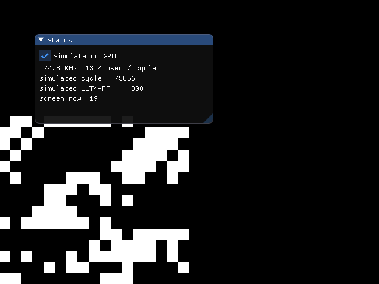
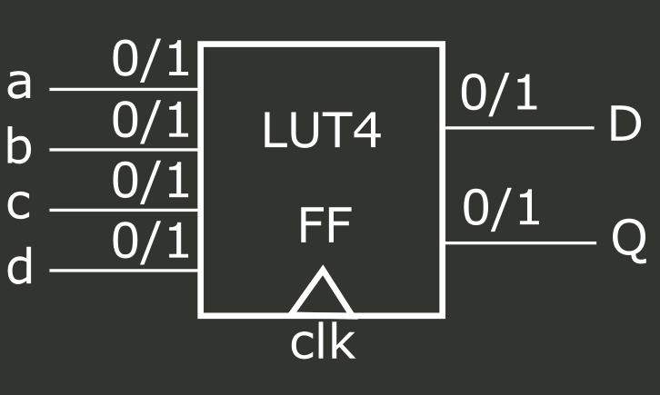
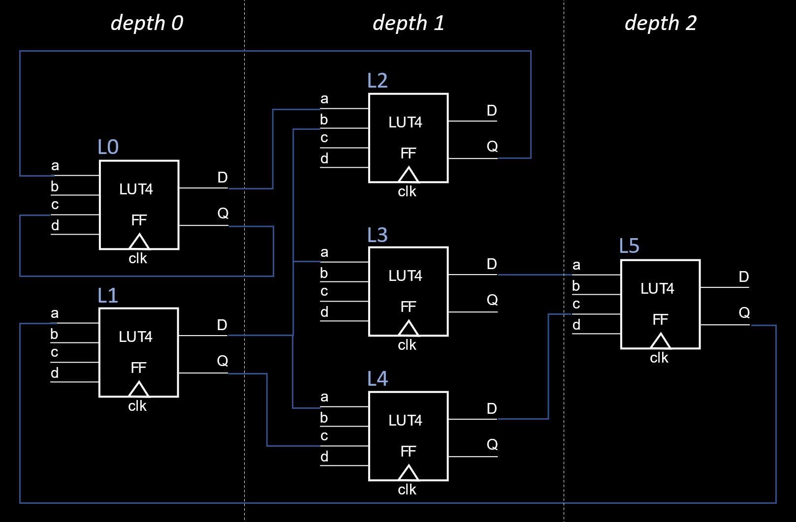

# Exploring gate-level simulation on CPU and GPU

This repository contains my experiments on gate-level simulation. By that I mean taking the output of [Yosys](https://github.com/YosysHQ/yosys) and simulating the gate network. This is done in the context of hardware design for FPGAs, with a graphics twist (because making your own [graphics hardware is fun](https://github.com/sylefeb/Silice/blob/master/projects/README.md)). As a quick reminder, hardware design is achieved by going from a hardware description (e.g. a source code in [Verilog](https://en.wikipedia.org/wiki/Verilog)) to a network of gates that implement the logic ; this is what Yosys does. This network of gates can be later turned into a configuration file for an [FPGA](https://www.nandland.com/articles/fpga-101-fpgas-for-beginners.html), or into lithography masks to actually manufacture [ASICs](https://en.wikipedia.org/wiki/Application-specific_integrated_circuit), in both cases implementing the design in hardware.

<p align="center">
<i>A VGA test design being simulated on the GPU, with gate binary outputs overlaid.<br>Synthesized on an FPGA this design produces the same pattern on a VGA output, 640x480 @60Hz.</i>
<br>
</p>

> The purpose of this repo is to learn about hardware simulation, having fun hacking and understanding how this is possible at all. We are thus implementing a toy simulator. For actual, efficient simulation please refer to [*Verilator*](https://www.veripool.org/verilator/), [*CXXRTL*](https://tomverbeure.github.io/2020/08/08/CXXRTL-the-New-Yosys-Simulation-Backend.html) and [*Icarus Verilog*](http://iverilog.icarus.com/).

> **Work in progress**: I am currently working on this README and commenting/cleaning the source code. Feedback is welcome!

This all started as I stumbled upon an entry to the Google CTF 2019 contest: [reversing-gpurtl](https://www.youtube.com/watch?v=3ac9HAsfV8c). The source code [is available](https://github.com/google/google-ctf/tree/master/2019/finals/reversing-gpurtl) and shows how to brute force a gate-level simulation onto the GPU.

*What does that mean? How does that work? We're going to precisely answer these questions!*

By analyzing the `reversing-gpurtl` source code and scripts (which are in Python and Rust), I got a good understanding of how the gate level simulation was achieved. And I was surprised to discover that it is *simple*!

But first, what is a *gate* in our context? The simplest (and only!) logical element in the network will be a *LUT4*. A LUT (Lookup Up Table) is a basic building block of an FPGA. A simplified LUT4 schematic would look like that:
<p align="center"></p>

The LUT4 has 4 single bit inputs (`a`,`b`,`c`,`d`) and two single bit outputs: `D` and `Q`. Output `D` is 'immediately' updated (as fast as the circuit can do it) when `a`,`b`,`c` or `d` change. Output `Q` is updated with the current value of `D` only when the clock ticks (positive edge on `clk`). Given `a`,`b`,`c`,`d` the value taken by `D` depends on the LUT configuration, which is a 16 entry truth table (configured by Yosys). It specifies the value of the output bit based on the values of `a`, `b`, `c` and `d`: four bits that can be either 0 or 1, and thus $2^4=16$ possibilities. This configuration implies that the LUT4 has a small internal memory (16 bits), which is indeed what gets configured by Yosys in the LUT4s.

Fundamentally, the idea for simulation is as follows:
1. First, ask Yosys to synthesize a design using only LUT4s, see the [script here](synth/synth.yosys).

1. Second, parse the result written by Yosys (a `blif` file) and prepare a data-structure for simulation. The file tells us about the LUT4s, their configurations and how they are connected. There are a few minor complications that are detailed in the source code comments.

1. Third, run the simulation! The basic idea (we'll improve next) is to simulate all LUTs in parallel. For each LUT, we read its four inputs and update its `D` output based on its configuration. Once nothing changes anymore, we simulate a positive clock edge by updating the `Q` output to reflect the value of the `D` output. Rinse and repeat.

And that's all there is for a basic, working simulator!

Let's now briefly look at an overview of the source code, and then take a closer look at how the simulation behaves. This will lead us to some optimizations, and will let us understand some performance tradeoffs.

## Source code overview

To give you a rough outline of the source code:
- Step 1 is covered in the [synth.yosys](synth/synth.yosys) script and [synth.sh](synth.sh).
- Step 2 is covered in [blif.cc](src/blif.cc) and [read.cc](src/read.cc)
- Step 3 is covered in [simul_cpu.cc](src/simul_cpu.cc) (CPU) and [simul_gpu.cc](src/simul_gpu.cc) (GPU), both being called from the main app [silixel.cc](src/silixel.cc). In terms of GPU the two important compute shaders are [sh_simul.cs](src/sh_simul.cs) and [sh_posedge.cs](src/sh_posedge.cs). A second application does only CPU simulation (see [silixel_cpu.cc](src/silixel_cpu.cc)). It is very simple so that can be a good starting point.

## A closer look and some improvements

Blindly simulating all LUTs in parallel works just fine. However, it is quite inefficient in terms of *effective simulated LUT per computation steps*. What do I meant by that?

Let us assume a perfectly parallel computer, with exactly one core per LUT (on a small design and large GPU this might just be the case!).
It turns out that, in most cases, at each 'parallel update' only few LUT outputs are actually changing. This is quite expected: at each simulation step the logic is unlikely to generate changes to all LUTs throughout the entire design. Well, to what extent this is true depends *entirely* on your design of course, but on most designs I tried only a small percentage of LUTs are actually modified at every iteration. This implies that a lot of LUT updates are wasted computations.

So what can we do to improve efficiency? We will apply two refinements. The first one
is used both on the CPU and GPU implementations. The second one is used only on the CPU implementation.

### *Refinement 1: sorting LUTs by combinational depth*

Let's have a look at a simple network:

<p align="center"></p>

I numbered the LUTs from `L0` to `L5`. The LUTs in the network have been arranged
by *combinational depth*. Given a LUT, the depth counts how many other LUTs are
in between any of its input and a Q (flip-flop) output, *at most* considering all inputs.

> Recall the D outputs are updated as soon as the inputs change (they are *combinational* outputs) while the Q outputs are updated only at the positive clock edge (*registered* outputs). Thus, within a clock cycle we propagate data from `Q` outputs to `D` outputs until nothing changes, before simulating the next positive clock edge and moving on to the next cycle.

For instance, `L0` is at depth 0 because both its inputs `a` and `c` read directly
from Q outputs. The same is true of `L1`.
Now `L4` is at depth 1 because while `c` reads from a Q output (which would mean depth 0), `a` reads from the D output of `L1`. Since `L1` is at depth 0, `L4` has to be depth 1. The final depth of the LUT is the largest considering all inputs.

The depth analysis is performed in [analyze.cc](src/analyze.cc).

How does that help? Remember that during simulation, we update all LUTs in parallel
until nothing changes, and then simulate a positive clock edge.
This introduces two problems. First, we need to track whether something change,
and with large numbers of LUTs that is not free if running parallel on the GPU, for instance.
Second, only few LUT outputs actually change at every iteration, while we update all of them.
In the illustrated example, `L5` would not change until the very last iteration. And during this last
iteration it is the only one to change, so the update is wasted on all other LUTs.

Having the depth gives us some nice properties to reduce the impact of these issues:
- Since we know the maximum overall depth (2 in the example) we know exactly
how many iterations to run and do not have to implement a 'no change' detection
(3 iterations in the example).
- LUTs at a same depth are independent from one another. Consider `L2`, `L3` and `L4`: changing
the D output of one does not impact the others.
This is true by construction since if one would depend on another, it would have been
assigned at the next depth in the network.
Furthermore, LUTs at a same depth only possibly depend on changes of
the D output of LUTs *at lower depths*. Thus, we can do less work at each iteration,
focusing only on the LUTs that could possibly change. In the example, we would
run three parallel iterations, first {`L0`,`L1`}, then {`L2`,`L3`,`L4`}, then {`L5`}.
This results in substantial savings. On the GPU, we can still update large chunks
of LUTs in parallel *without any synchronization* (LUTs at a same depth), which is
ideal.

> The maximum depth also reflects at what max frequency the circuit can run. Indeed, assuming
it takes the same delay for signal to propagate through all LUTs, the number of LUTs
to traverse *at most* determines the worst case propagation delay, and hence the
maximum frequency. This is often reported as the *critical path* by place and route software
such as [nextpnr](https://github.com/YosysHQ/nextpnr).

Now we have seen all the ingredients of the GPU implementation.
See in particular function `simulCycle_gpu` in source file [`simul_gpu.cc`](src/simul_gpu.cc),
that calls the compute shaders once for each depth level, and then for the positive clock edge.

> A detail, not discussed here, is that some LUTs remain constant during simulation
and can be skipped after initialization. This is done in the implementation.

### *Refinement 2: fanout and compute lists*

The first refinement avoids blind updates to all LUTs. However, it remains
very likely that within a set of LUTs at a same depth, many are updated while
their inputs did not change. Consider {`L2`,`L3`,`L4`}. If only the D output of `L0` changed,
then only `L2` actually requires an update.

This second refinement avoids this issue, implementing a *compute list* per depth level
(including the final positive edge update of Q outputs).
An iteration at a given depth *k* inserts LUTs that should be refreshed in the compute lists of the next depth levels (> *k*).
These are the LUTs using as input the changing D output of a LUT at depth *k*.

To do this efficiently, we first compute the *fanout* of the LUTs. Let us consider a single LUT:
its fanout is the list of LUTs that use its D output, and of course all are deeper in the
network. Given this list, whenever a LUT D output changes we can efficiently insert all LUTs of
its fanout to the compute lists
(see `addFanout` in source file [`simul_cpu.cc`](src/simul_cpu.cc)). LUTs are inserted
only once thanks to a 'dirty bit' flag.

This approach works very well on the CPU, which is using a single thread and is
anyway a sequential traversal. In fact, it outperforms the GPU on all but very large
designs (which, on top of it, are large for bad reasons due to memories (BRAM/SPRAM)
being turned into humongous networks of LUTs).

> This approach is not easily amenable to the GPU. I actually tried, but this required
atomic updates, synchronization and indirect compute dispatch ... which in the end
together killed performance. But it might be that I did not find the right way yet!

> Performance can be further improved on the CPU. First, the computations seem a
case for SSE instructions. Second, I should be using more cores! However,
like on the GPU, synchronization can quickly become a performance bottleneck...

Alright, time for some compilation and testing!

## Compile and run

First, make sure to get the submodules:
```
git submodule init
git submodule update
```
Use `CMake` to prepare a Makefile for your system (possibly use `-G` to specify the makefile generator), then `make`:
```
cd build
cmake ..
make
cd ..
```
Before simulating, we have to run Yosys on a design (a Verilog source file).
Yosys has to be installed and in PATH.
From a command line in the repo root, run:

```
./synth.sh silice_vga_test
```

This synthesizes a design ([silice_vga_test.v](designs/silice_vga_test.v)) and
generates the output in [`build`](./build). There are several designs, see [`designs`](./designs/).

After running `./build/src/silixel` you should see this:

<p align="center"></p>

Time to experiment, the source code is yours to hack!
Please let me know what you thought, and feel free to [reach out on Twitter](https://twitter.com/sylefeb/).
